# 💝 Social Good Donations Microsite

[](https://nextjs.org/)
[](https://reactjs.org/)
[](https://www.typescriptlang.org/)
[](https://tailwindcss.com/)
[](LICENSE)

A professional, full-stack donation platform that seamlessly integrates modern web technologies with secure payment processing, intelligent email automation, and comprehensive content management.

## ✨ Features

### 🚀 **Core Functionality**
- **💳 Secure Payment Processing** - Integrated PayPal REST API with sandbox/live environment support
- **📧 Automated Email System** - Personalized thank-you emails with Gmail SMTP integration
- **🤖 AI-Powered Content** - Google Gemini AI generates personalized donor communications
- **📊 Admin Dashboard** - Comprehensive donation tracking and analytics
- **📝 Content Management** - Real-time content editing with markdown support
- **🔍 Health Monitoring** - Built-in system health checks and error reporting

### 🎨 **User Experience**
- **📱 Responsive Design** - Mobile-first approach with Tailwind CSS
- **⚡ Fast Performance** - Next.js App Router with optimized loading
- **🎯 Intuitive Interface** - Clean, accessible donation flow
- **🔒 Secure Processing** - PCI-compliant payment handling

### 🛠 **Technical Excellence**
- **🏗️ Modern Architecture** - TypeScript, React 19, Next.js 15
- **📦 JSON Database** - Lightweight, file-based storage for rapid development
- **🔧 API-First Design** - RESTful endpoints for all operations
- **🧪 Error Handling** - Comprehensive validation and fallback systems

## 🏗️ System Architecture

### Data Flow Diagram

```mermaid
graph TD
    %% External Entities
    User[👤 Donor/User]
    Admin[👨‍💼 Admin User]
    PayPal[💳 PayPal API]
    Gmail[📧 Gmail SMTP]
    Gemini[🤖 Google Gemini AI]
    
    %% Main Application
    subgraph "Next.js Application"
        %% Frontend Components
        HomePage[🏠 Homepage<br/>src/app/page.tsx]
        DonationForm[💝 Donation Form<br/>src/components/DonationForm.tsx]
        AdminPanel[⚙️ Admin Panel<br/>src/app/admin/]
        HealthCheck[🔍 Health Check<br/>src/components/ServerHealthCheck.tsx]
        
        %% API Layer
        subgraph "API Routes"
            DonationAPI[📝 Donation Submit<br/>/api/donations/submit]
            PayPalCreate[💰 PayPal Create<br/>/api/paypal/create-order]
            PayPalCapture[✅ PayPal Capture<br/>/api/paypal/capture-order]
            ContentAPI[📄 Content API<br/>/api/admin/content]
            AdminAPI[🔐 Admin API<br/>/api/admin/login]
            TestAPI[🧪 Test API<br/>/api/test]
        end
        
        %% Business Logic Layer
        subgraph "Library Functions"
            DatabaseLib[💾 Database<br/>src/lib/database.ts]
            EmailLib[📬 Email Service<br/>src/lib/gmail.ts]
            AILib[🧠 AI Service<br/>src/lib/gemini.ts]
            CMSLib[📝 CMS Service<br/>src/lib/cms.ts]
        end
    end
    
    %% Data Stores
    DonationDB[(💾 Donations Database<br/>data/donations.json)]
    ContentFiles[(📁 Content Files<br/>content/*.md)]
    
    %% User Interactions
    User --> HomePage
    User --> DonationForm
    Admin --> AdminPanel
    
    %% Frontend to API flows
    HomePage --> ContentAPI
    DonationForm --> DonationAPI
    DonationForm --> PayPalCreate
    DonationForm --> PayPalCapture
    AdminPanel --> AdminAPI
    AdminPanel --> ContentAPI
    HealthCheck --> TestAPI
    
    %% API to Library flows
    DonationAPI --> DatabaseLib
    DonationAPI --> EmailLib
    DonationAPI --> AILib
    PayPalCreate --> PayPal
    PayPalCapture --> PayPal
    PayPalCapture --> DatabaseLib
    PayPalCapture --> EmailLib
    PayPalCapture --> AILib
    ContentAPI --> CMSLib
    
    %% Library to External/Storage flows
    DatabaseLib --> DonationDB
    EmailLib --> Gmail
    AILib --> Gemini
    CMSLib --> ContentFiles
    
    %% External API responses
    PayPal --> PayPalCreate
    PayPal --> PayPalCapture
    Gmail --> EmailLib
    Gemini --> AILib
    
    %% Data flow back to user
    ContentAPI --> HomePage
    DonationAPI --> DonationForm
    PayPalCreate --> DonationForm
    PayPalCapture --> DonationForm
    TestAPI --> HealthCheck
    
    %% Styling
    classDef userEntity fill:#e1f5fe,stroke:#01579b,stroke-width:2px
    classDef external fill:#fff3e0,stroke:#e65100,stroke-width:2px
    classDef api fill:#f3e5f5,stroke:#4a148c,stroke-width:2px
    classDef library fill:#e8f5e8,stroke:#1b5e20,stroke-width:2px
    classDef storage fill:#fce4ec,stroke:#880e4f,stroke-width:2px
    classDef frontend fill:#e3f2fd,stroke:#0d47a1,stroke-width:2px
    
    class User,Admin userEntity
    class PayPal,Gmail,Gemini external
    class DonationAPI,PayPalCreate,PayPalCapture,ContentAPI,AdminAPI,TestAPI api
    class DatabaseLib,EmailLib,AILib,CMSLib library
    class DonationDB,ContentFiles storage
    class HomePage,DonationForm,AdminPanel,HealthCheck frontend
```



The system follows a clean three-tier architecture:
- **Presentation Layer**: React components with responsive UI
- **API Layer**: Next.js API routes handling business logic
- **Data Layer**: JSON file storage with external service integrations

## 🛠️ Tech Stack

| Category | Technology | Purpose |
|----------|------------|---------|
| **Frontend** | React 19 + Next.js 15 | Server-side rendering and app framework |
| **Styling** | Tailwind CSS 4 | Utility-first responsive design |
| **Language** | TypeScript 5 | Type safety and developer experience |
| **Payment** | PayPal REST API | Secure payment processing |
| **Email** | Nodemailer + Gmail | Automated email notifications |
| **AI** | Google Gemini API | Personalized content generation |
| **Database** | JSON file storage | Lightweight data persistence |
| **Content** | Markdown + gray-matter | Dynamic content management |
| **Icons** | Lucide React | Consistent iconography |
| **Deployment** | Vercel | Serverless hosting platform |

## 🚀 Quick Start

### Prerequisites
- **Node.js** 18.x or higher ([Download](https://nodejs.org/))
- **npm** 9.x or **yarn** 3.x
- **Gmail account** with app password enabled (for email notifications)
- **PayPal developer account** (for payment processing)
- **Google AI API key** (optional, for personalized emails)

### Installation

1. **Clone the repository:**
   ```bash
   git clone <repository-url>
   cd donations-microsite
   ```

2. **Install dependencies:**
   ```bash
   npm install
   # or
   yarn install
   ```

3. **Environment Configuration:**
   
   Create a `.env.local` file in the root directory:
   
   ```env
   # PayPal Configuration (Required)
   PAYPAL_MODE=sandbox                              # Use 'live' for production
   PAYPAL_CLIENT_ID=your_paypal_client_id
   PAYPAL_CLIENT_SECRET=your_paypal_client_secret
   NEXT_PUBLIC_PAYPAL_CLIENT_ID=your_paypal_client_id
   
   # Gmail Configuration (Required)
   EMAIL_USER=your_gmail@gmail.com
   EMAIL_PASSWORD=your_gmail_app_password           # Not your regular password!
   
   # Google Gemini AI (Optional)
   GEMINI_API_KEY=your_gemini_api_key              # For AI-generated emails
   
   # Admin Access (Required)
   ADMIN_PASSWORD=your_secure_admin_password
   ```

4. **Start the development server:**
   ```bash
   npm run dev
   ```

### 🌐 Application Access

| Service | URL | Purpose |
|---------|-----|---------|
| **Main Website** | http://localhost:3000 | Public donation interface |
| **Admin Panel** | http://localhost:3000/admin | Admin dashboard and analytics |
| **Content Editor** | http://localhost:3000/admin/content | Live content editing |
| **API Health** | http://localhost:3000/api/test | System health check |

### ⚡ Quick Test

Test the donation flow without payment processing:
```bash
curl -X POST http://localhost:3000/api/donations/submit \
  -H "Content-Type: application/json" \
  -d '{
    "donorName": "Test User",
    "donorEmail": "test@example.com",
    "amount": 25,
    "frequency": "One-time",
    "message": "Test donation"
  }'
```

## 🚀 Production Deployment

### Vercel Deployment (Recommended)

[](https://vercel.com/new/clone?repository-url=https://github.com/yourusername/donations-microsite)

1. **Push to GitHub:**
   ```bash
   git init
   git add .
   git commit -m "Initial deployment"
   git branch -M main
   git remote add origin https://github.com/yourusername/donations-microsite.git
   git push -u origin main
   ```

2. **Deploy on Vercel:**
   - Connect your GitHub repository
   - Configure environment variables (see configuration above)
   - Deploy automatically

3. **Production Environment Variables:**
   ```env
   PAYPAL_MODE=live                    # Switch to live mode
   PAYPAL_CLIENT_ID=live_client_id
   PAYPAL_CLIENT_SECRET=live_secret
   # ... other variables remain the same
   ```

### Alternative Deployment Options
- **Docker**: Dockerfile included for containerized deployment
- **Traditional VPS**: Compatible with any Node.js hosting
- **Netlify**: Works with static site generation
- **AWS/Azure**: Serverless function deployment supported

## 📡 API Reference

### Core Endpoints

| Endpoint | Method | Purpose | Auth Required |
|----------|--------|---------|---------------|
| `/api/donations/submit` | POST | Process donation | No |
| `/api/donations/list` | GET | List all donations | Yes |
| `/api/paypal/create-order` | POST | Create PayPal order | No |
| `/api/paypal/capture-order` | POST | Capture payment | No |
| `/api/admin/content` | GET/POST | Content management | Yes |
| `/api/admin/login` | POST | Admin authentication | No |
| `/api/admin/stats` | GET | Donation analytics | Yes |
| `/api/test` | GET | Health check | No |

### Sample API Usage

**Submit a Donation:**
```javascript
const response = await fetch('/api/donations/submit', {
  method: 'POST',
  headers: { 'Content-Type': 'application/json' },
  body: JSON.stringify({
    donorName: 'John Doe',
    donorEmail: 'john@example.com',
    amount: 50,
    frequency: 'One-time',
    message: 'Keep up the great work!'
  })
});
```

**Get Donation Statistics:**
```javascript
const stats = await fetch('/api/admin/stats', {
  headers: { 'Authorization': 'Bearer admin-token' }
});
```

For detailed API documentation, see [DATA_FORMATS.md](DATA_FORMATS.md).

## 📁 Project Structure

```
donations-microsite/
├── 📁 src/
│   ├── 📁 app/                    # Next.js App Router
│   │   ├── 📁 admin/              # Admin interface
│   │   │   ├── 📁 content/        # Content management
│   │   │   ├── 📁 login/          # Authentication
│   │   │   └── page.tsx           # Dashboard
│   │   ├── 📁 api/                # API endpoints
│   │   │   ├── 📁 admin/          # Admin APIs
│   │   │   ├── 📁 donations/      # Donation processing
│   │   │   ├── 📁 paypal/         # PayPal integration
│   │   │   └── 📁 test/           # Health checks
│   │   ├── layout.tsx             # Root layout
│   │   ├── page.tsx               # Homepage
│   │   └── globals.css            # Global styles
│   ├── 📁 components/             # React components
│   │   ├── DonationForm.tsx       # Main donation form
│   │   └── ServerHealthCheck.tsx  # Health monitoring
│   └── 📁 lib/                    # Business logic
│       ├── database.ts            # JSON database
│       ├── gmail.ts               # Email service
│       ├── gemini.ts              # AI integration
│       └── cms.ts                 # Content management
├── 📁 content/                    # Markdown content
│   ├── hero.md                    # Homepage hero
│   ├── about.md                   # About section
│   └── impact.md                  # Impact statistics
├── 📁 data/                       # Data storage
│   └── donations.json             # Donation records
├── 📁 public/                     # Static assets
│   └── 📁 admin/                  # CMS interface
├── 📄 package.json                # Dependencies
├── 📄 next.config.ts              # Next.js config
├── 📄 tailwind.config.ts          # Tailwind config
├── 📄 DATA_FORMATS.md             # Data documentation
├── 📄 DEPENDENCIES.md             # Dependency guide
└── 📄 README.md                   # This file
```

## 🎨 Customization Guide

### 🎯 **Content Management**
```bash
# Access content editor
http://localhost:3000/admin/content

# Direct file editing
content/
├── hero.md      # Homepage hero section
├── about.md     # About section content  
└── impact.md    # Impact statistics
```

### 🎨 **Styling & Theming**
```typescript
// tailwind.config.ts - Update theme colors
module.exports = {
  theme: {
    extend: {
      colors: {
        primary: '#your-brand-color',
        secondary: '#your-accent-color'
      }
    }
  }
}
```

### 📧 **Email Templates**
```typescript
// src/lib/gmail.ts - Customize email templates
const mailOptions = {
  subject: 'Your Custom Subject',
  html: `Your custom HTML template`
};
```

### 🤖 **AI Prompts**
```typescript
// src/lib/gemini.ts - Modify AI prompts
const prompt = `Your custom prompt for generating personalized emails`;
```

## 🔧 Development Tools

### Available Scripts
```bash
npm run dev          # Start development server
npm run build        # Build for production
npm run start        # Start production server
npm run lint         # Run ESLint
npm run type-check   # TypeScript validation
```

### Testing
```bash
# Manual API testing
curl http://localhost:3000/api/test

# Check system health
http://localhost:3000/api/test
```

## 🐛 Troubleshooting

### Common Issues & Solutions

| Issue | Cause | Solution |
|-------|-------|----------|
| **Email not sending** | Gmail app password | Enable 2FA, create app-specific password |
| **PayPal errors** | Invalid credentials | Verify sandbox/live mode and credentials |
| **Build failures** | Node.js version | Use Node.js 18.x or higher |
| **API timeouts** | External service | Check network and API key validity |
| **Permission errors** | File access | Ensure write permissions for `data/` folder |

### Debug Mode
```bash
# Enable detailed logging
DEBUG=* npm run dev

# Check environment variables
node -e "console.log(process.env)"
```

### Health Monitoring
- **System Status**: http://localhost:3000/api/test
- **Console Logs**: Check browser developer tools
- **Server Logs**: Monitor terminal output during development

## 🤝 Contributing

We welcome contributions! Please follow these guidelines:

### Development Setup
1. Fork the repository
2. Create a feature branch: `git checkout -b feature-name`
3. Make your changes and add tests
4. Follow the existing code style
5. Submit a pull request

### Code Standards
- **TypeScript**: Strict type checking enabled
- **ESLint**: Follow configured rules
- **Formatting**: Use Prettier for consistent formatting
- **Testing**: Add tests for new functionality

### Pull Request Process
1. Update documentation for any new features
2. Ensure all tests pass
3. Update the changelog
4. Request review from maintainers

## 📄 License

**MIT License** - See [LICENSE](LICENSE) file for details

This project is open source and available under the MIT License. Feel free to use, modify, and distribute for personal or commercial projects.

## 🙋‍♂️ Support & Community

- **Documentation**: [DATA_FORMATS.md](DATA_FORMATS.md) | [DEPENDENCIES.md](DEPENDENCIES.md)
- **Issues**: [GitHub Issues](https://github.com/yourusername/donations-microsite/issues)
- **Discussions**: [GitHub Discussions](https://github.com/yourusername/donations-microsite/discussions)

---

<div align="center">

**⭐ If this project helped you, please consider giving it a star! ⭐**

Made with ❤️ for making the world a better place through technology

</div>
